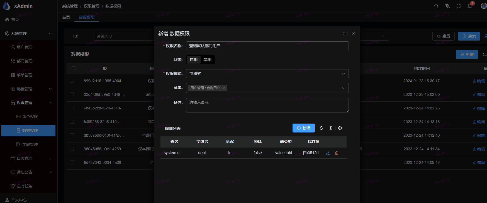
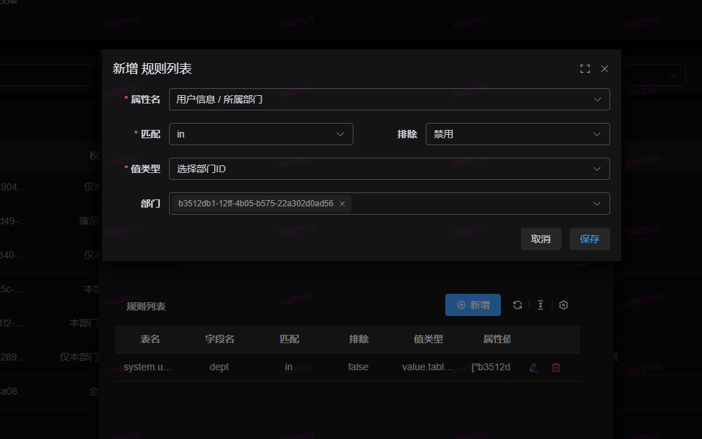

## 数据权限控制

原理： 数据权限是通过 ```queryset.filter``` 来实现。

在 ```settings.py``` 定义了一个全局的```DEFAULT_FILTER_BACKENDS```,
具体方法```common.core.filter.BaseDataPermissionFilter```

具体的实现方式参考```common.core.filter.get_filter_queryset```

如果自定义方法使用全局的filter,可以通过下面获取queryset对象

```python
filter_queryset = self.filter_queryset(self.get_queryset())
```

1. 权限模式, 且模式表示数据需要同时满足规则列表中的每条规则，或模式即满足任意一条规则即可
2. 若存在菜单权限，则该权限仅针对所选择的菜单权限生效

## 如何使用？本次使用是查询指定条件用户的数据权限

### 1. 在前端页面菜单中，添加数据权限，然后选择菜单为查询用户，规则选择





将该数据权限分配给用户即可

## 排障：用户看到空集 / 规则不生效

数据权限是 fail-closed 口径（无适用授权即空集），排查分三步：

1. **规则存储体检**——与写入侧 `validate_rules` 同源校验存量规则，列出非法授权及原因
   （报错带规则序号与字段/匹配符上下文），并给出「不生效」提示（`[WARN]`，不影响退出码）：

   ```bash
   python manage.py audit_data_permission_rules               # 只列出，不改库
   python manage.py audit_data_permission_rules --strict      # CI 门禁：发现非法即非零退出
   python manage.py audit_data_permission_rules --deactivate  # 非法授权整体停用（is_active=False）
   ```

   `[WARN]` 覆盖三类「规则合法但对绑定对象恒为空集」的配置：未绑定任何用户/部门；
   「主管部门」类规则绑定对象中没有任何部门主管；规则引用的用户/部门/角色/菜单已被删除。
   提示只列不改（部分可能是有意配置），修正后重跑确认。

2. **用户视角试算**——数据权限页的「试算」面板按目标用户实跑 `get_filter_queryset`，
   展示实际生效的授权、规则可读文案与命中结果，回答「他为什么能/不能看到这条数据」。

3. **运行时日志**——读侧对坏规则 fail-closed 时会打 `data scope rule ... fail-closed` 告警
   （字段不存在 / 无法编译），绑定用户看到空集时可从日志定位到具体模型与字段。

## 规则配置与语义口径（配置页）

配置页（系统管理 → 权限管理 → 数据权限）与运行时读侧同源，界面把以下口径显式化：

| 概念 | 口径 | 配置位置 |
|------|------|----------|
| 规则配置 | 过滤对象（应用 / 模型 / 字段级联，落到 表.字段；「全部表」节点表示跨模型通用字段）+ 取值方式 + 匹配条件 + 取值 + 方向（包含/排除） | 新增/编辑抽屉 → 规则列表（行内编辑卡片） |
| 匹配逻辑 | 可用匹配条件 = 字段 class lookups ∪ 框架自定义匹配符（`m2m`/`m2m_all`/`ip_in`/`all`）；「跟随当前用户」「指定对象」类取值方式由读取侧固定匹配（in/exact），界面只读展示 | 规则编辑卡片的「匹配条件」 |
| 取值方式 | 全部数据 / 跟随当前用户（本人、本部门、本部门及下级、主管部门…）/ 指定对象（用户、角色、部门、菜单）/ 时间条件 / 自定义值；值控件形态（文本、JSON、时间、时间段、选人、选部门…）由后端 `choices` 下发，前端不硬编码。选「全部数据」时过滤对象与匹配条件保留为只读（路径锁到 `* / *`），避免控件整块消失 | 规则编辑卡片的「取值方式」+「取值」 |
| 生效范围 | 绑定接口权限点后仅对该接口生效；勾选页面/目录 = 该页面下全部接口（保存时展开归一为权限点）；不绑定 = 对所有接口生效 | 新增/编辑抽屉的「菜单权限」→「选择生效接口」 |
| 分配对象 | 授权分配给用户或部门（部门含其下级成员，仅启用部门上的授权生效） | 用户管理 / 部门管理的「数据权限」字段 |
| 优先级 | 单条授权内多规则按该授权的且/或模式组合（且模式下「全部数据」被忽略，或模式下支配整组）；**多条授权之间取并集（最宽生效）**——授权只放宽范围，不能用授权收紧其他授权；无任何适用授权即空集；超管豁免 | 组合模式选择 + 「生效说明」 |
| 试算 | 未保存的规则草稿即可试算（与保存同一套写入校验），给出命中行数、样本行、实际参与编译的授权来源 | 抽屉内「即时试算（未保存的规则）」 |

> 列表页另带出每条授权的「规则数 / 生效接口数 / 分配对象数」，用于快速判断「这条授权管什么、给谁」。
> 界面上的规则可读摘要与匹配符文案与预览解码同源（后端 `rule_meta`）：新增规则类型只需在后端登记
> `RULE_TYPE_META`（值控件形态/分组/建议匹配符）与 `RULE_TYPE_TEXTS`（语义文案），配置页零改动。