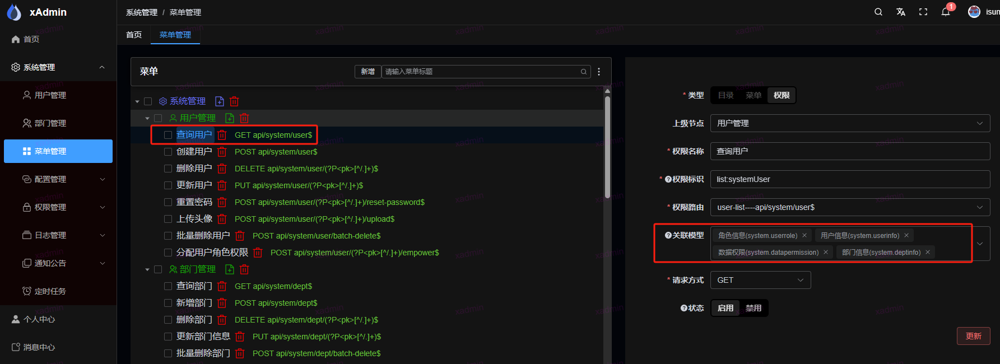
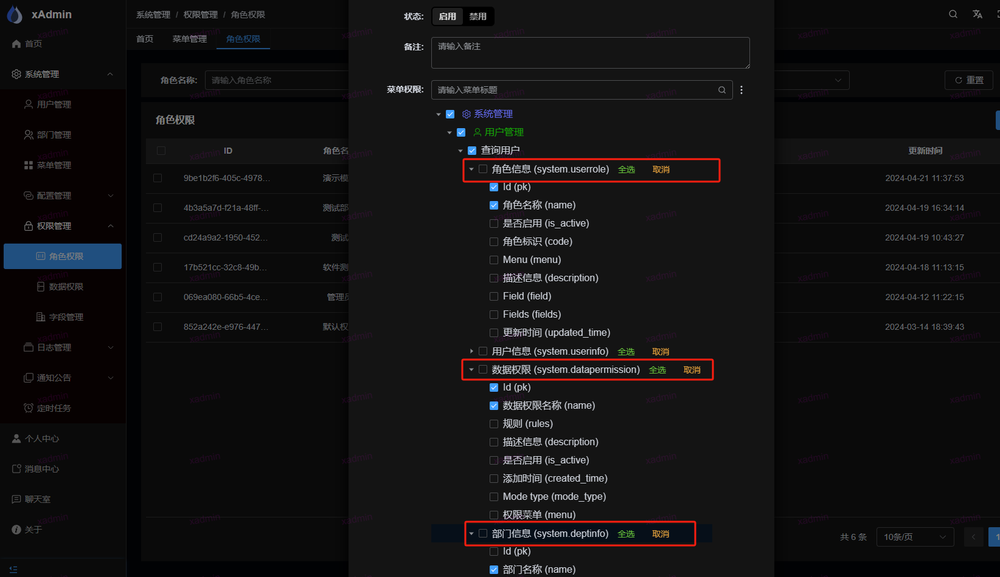

## 字段权限控制

原理： 字段权限是通过 ```djangorestframework``` 中的 ```ModelSerializer``` 来实现。

若要使用字段权限，则需要继承 ```BaseModelSerializer``` 参考 ```common/core/serializers.py```

1. 请求先通过```common.core.permission.IsAuthenticated```, 获取该请求的菜单，通过菜单获取绑定的模型，通过模型获取字段
2. 然后在使用 ```common.core.serializers.BaseModelSerializer``` 的时候，会调用```__init__```方法，在该方法中定义了所需字段

## 如何使用？本次使用是查询用户权限

### 1. 在前端页面菜单中，添加权限，然后选择关联模型



#### 为什么要关联这四个模型？

用户序列化器在 `system/serializers/user.py`，部分代码如下（节选，完整以真源为准）：

```python
class UserSerializer(BaseModelSerializer):
    class Meta:
        model = UserInfo
        fields = [
            "pk",
            "avatar",
            "username",
            "nickname",
            "phone",
            "email",
            "gender",
            "block",
            "online_count",
            "is_active",
            "dept",
            "description",
            "last_login",
            "date_joined",
            "roles",
            "rules",
            "deleted_at",
        ]
        extra_kwargs = {
            "roles": {"required": False, "attrs": ["pk", "name", "code"], "format": "{name}", "many": True},
            "rules": {
                "required": False,
                "attrs": ["pk", "name", "get_mode_type_display"],
                "format": "{name}",
                "many": True,
            },
            "dept": {"required": False, "attrs": ["pk", "name", "parent_id"], "format": "{name}"},
        }
```

获取用户的序列化结果里携带了 `roles` 角色模型、`rules` 数据权限模型、`dept` 部门模型
（`attrs`/`format` 控制内联展示的候选字段与显示文案），还有自己本身的 `UserInfo` 模型

### 2. 在 角色权限中，创建角色，并关联字段



#### 为什么查询用户下面有四个？

之前关联的模型有几个，查询用户下面就会有几个字段选择模型

#### 为什么角色信息，数据权限中，进勾选了 ```Id (pk)```,```角色名称|数据权限名称 (name)```

```python
roles_info = RoleSerializer(fields=["pk", "name"], many=True, read_only=True, source="roles")
dept_info = DeptSerializer(fields=["name", "pk"], read_only=True, source="dept")
```

这两个，因为上面定义的用户序列化方法中，仅仅使用了这两个字段, 其他字段无需勾选，勾选也不会显示，如果要想显示其他字段，则需在修改如下

```python
roles_info = RoleSerializer(ignore_field_permission=True, many=True, read_only=True, source="roles")
```
## 部署前提：详情菜单字段白名单（常见误判）

**字段权限启用时，未配置白名单的模型字段会被裁剪为空（运行时不可见）**——这是既定语义
（默认拒绝，fail-closed），但有一个容易被忽略的推论：

> 角色只配置了「列表菜单」的字段白名单、没有配置「详情菜单」的白名单时，
> 详情抽屉会渲染出一块**空白**（所有字段都被裁空），看起来像数据丢失。

处置：

1. 给角色 × **详情菜单**（`retrieve` 权限码所在菜单）配置字段白名单，与列表菜单同口径；
2. 前端已在详情抽屉对「整行皆空」的情况给出可读提示（`plus.detailBlankTip`），
   提示文案与运行时语义一致（2026-09-11 起）；
3. 排查命令：检查 `FieldPermission` 是否绑定了 GET 详情菜单
   （历史教训：绑到 POST 会导致白名单查询落空、行被裁空，见 E2E 种子修复记录）。
