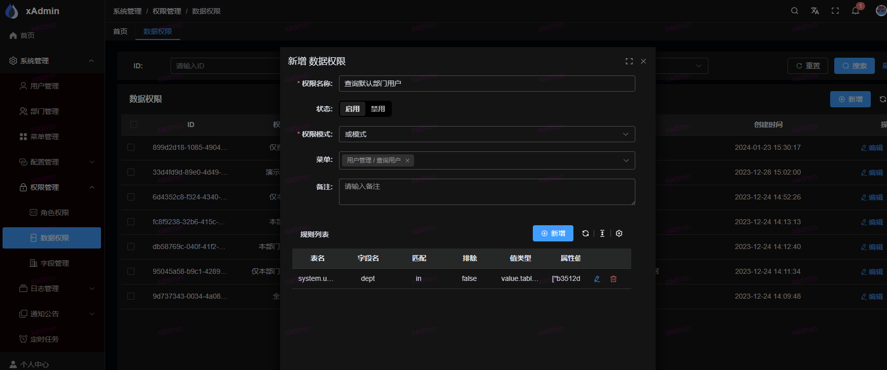
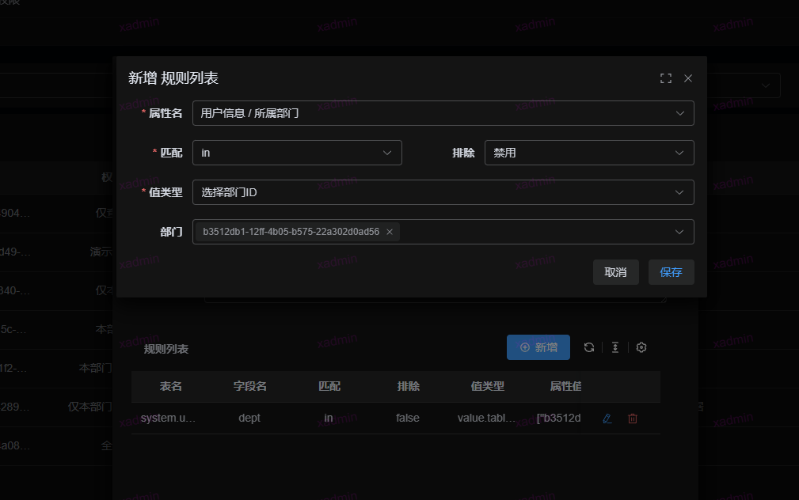

## 数据权限控制

原理： 数据权限是通过 ```queryset.filter``` 来实现。

在 ```settings.py``` 定义了一个全局的```DEFAULT_FILTER_BACKENDS```,
具体方法```common.core.filter.BaseDataPermissionFilter```

具体的实现方式参考```common.core.filter.get_filter_queryset```

如果自定义方法使用全局的filter,可以通过下面获取queryset对象

```python
filter_queryset = self.filter_queryset(self.get_queryset())
```

1. 权限模式, 且模式表示数据需要同时满足规则列表中的每条规则，或模式即满足任意一条规则即可
2. 若存在菜单权限，则该权限仅针对所选择的菜单权限生效

## 如何使用？本次使用是查询指定条件用户的数据权限

### 1. 在前端页面菜单中，添加数据权限，然后选择菜单为查询用户，规则选择





将该数据权限分配给用户即可