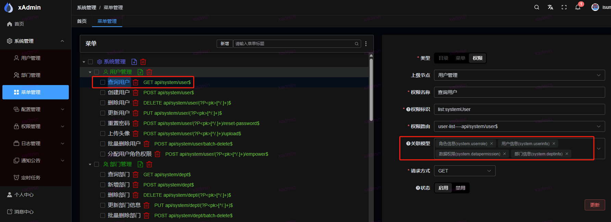
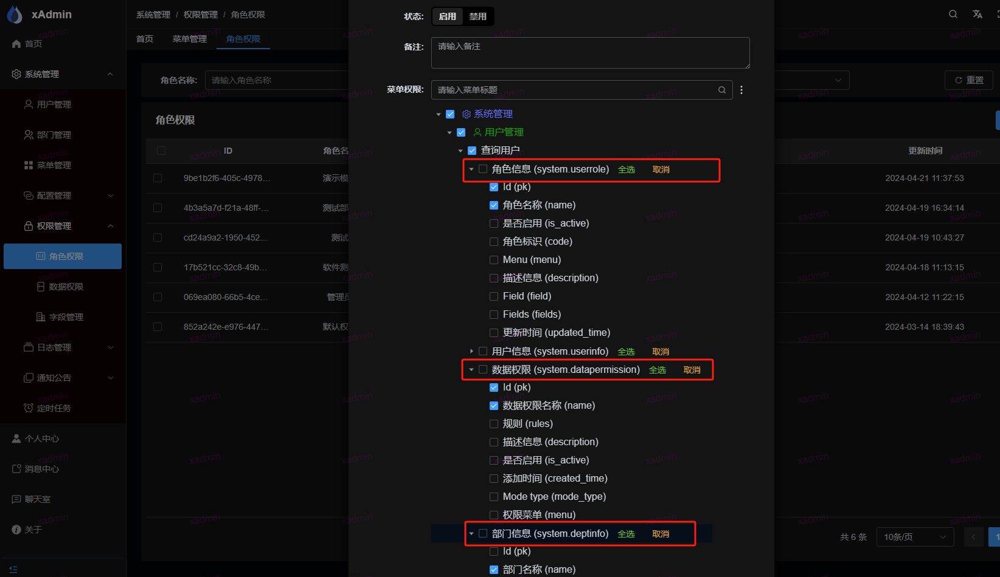

## 字段权限控制

原理： 字段权限是通过 ```djangorestframework``` 中的 ```ModelSerializer``` 来实现。

若要使用字段权限，则需要继承 ```BaseModelSerializer``` 参考 ```system/utils/serializer.py```

1. 请求先通过```common.core.permission.IsAuthenticated```, 获取该请求的菜单，通过菜单获取绑定的模型，通过模型获取字段
2. 然后在使用 ```common.core.serializers.BaseModelSerializer``` 的时候，会调用```__init__```方法，在该方法中定义了所需字段

## 如何使用？本次使用是查询用户权限

### 1. 在前端页面菜单中，添加权限，然后选择关联模型



#### 为什么要关联这四个模型？

代码中```system/utils/serializer.py```部分代码如下

```python
class BaseRoleRuleInfo(BaseModelSerializer):
    roles_info = RoleSerializer(fields=['pk', 'name'], many=True, read_only=True, source='roles')
    rules_info = DataPermissionSerializer(fields=['pk', 'name'], many=True, read_only=True, source='rules')
    mode_type = LabeledChoiceField(choices=models.ModeTypeAbstract.ModeChoices.choices)


class UserSerializer(BaseRoleRuleInfo):
    class Meta:
        model = models.UserInfo
        fields = ['username', 'nickname', 'email', 'last_login', 'gender', 'date_joined', 'roles', 'rules', 'is_active',
                  'pk', 'dept', 'phone', 'avatar', 'roles_info', 'description', 'dept_info', 'rules_info', 'mode_type']
        extra_kwargs = {'last_login': {'read_only': True}, 'date_joined': {'read_only': True},
                        'rules': {'read_only': True}, 'pk': {'read_only': True}, 'avatar': {'read_only': True},
                        'roles': {'read_only': True}}
        # extra_kwargs = {'password': {'write_only': True}}
        read_only_fields = ['pk'] + list(set([x.name for x in models.UserInfo._meta.fields]) - set(fields))

    dept_info = DeptSerializer(fields=['name', 'pk'], read_only=True, source='dept')
    gender = LabeledChoiceField(choices=models.UserInfo.GenderChoices.choices)
```

获取用户的序列化方法，里面使用了```roles_info 角色模型```，```dept_info 部门模型```，```rules_info 数据权限模型```
，还有自己本身的```UserInfo 模型```

### 2. 在 角色权限中，创建角色，并关联字段



#### 为什么查询用户下面有四个？

之前关联的模型有几个，查询用户下面就会有几个字段选择模型

#### 为什么角色信息，数据权限中，进勾选了 ```Id (pk)```,```角色名称|数据权限名称 (name)```

```python
roles_info = RoleSerializer(fields=['pk', 'name'], many=True, read_only=True, source='roles')
dept_info = DeptSerializer(fields=['name', 'pk'], read_only=True, source='dept')
```

这两个，因为上面定义的用户序列化方法中，仅仅使用了这两个字段, 其他字段无需勾选，勾选也不会显示，如果要想显示其他字段，则需在修改如下

```python
roles_info = RoleSerializer(ignore_field_permission=True, many=True, read_only=True, source='roles')
```